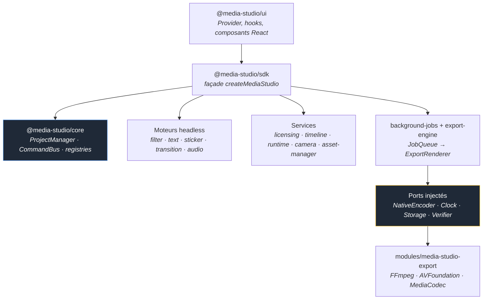

<div align="center">

# 🎬 Media Studio SDK

**Le SDK de création, d'édition et d'export photo/vidéo pour React Native + Expo.**

Caméra, éditeur photo, éditeur vidéo, filtres, textes animés, stickers, transitions,
audio et export en arrière-plan — dans un socle **100 % headless**, entièrement
remplaçable, pilotable sans interface.

[](https://reactnative.dev)
[](https://expo.dev)
[](https://www.typescriptlang.org)
[](https://pnpm.io)
[](https://turbo.build)
[](./LICENSE)
[](./docs/10-ROADMAP.md)

**[English ↗](./README.md)** · [Documentation](./docs/README.md) · [Architecture](./docs/01-ARCHITECTURE.md) · [Roadmap](./docs/10-ROADMAP.md) · [Exemples](#-exemples)

</div>

---

## Pourquoi ce SDK

La plupart des bibliothèques d'édition média imposent leur UI, leur pipeline natif et
leur modèle de données. Media Studio fait l'inverse :

| Principe | Ce que ça change concrètement |
|---|---|
| 🧠 **Headless-first** | Toute la logique (projet, commandes, moteurs, export) tourne dans Node, sans device ni UI. Testable en millisecondes. |
| 🔌 **Ports injectés** | Aucune dépendance native en dur : `NativeEncoder`, `Clock`, `LicenseValidator`, `StorageAdapter`, `PluginVerifier`, `FontManager`… sont fournis par l'intégrateur. |
| 🎛️ **UI remplaçable** | Les composants React fournis sont une commodité, pas une contrainte. Vous branchez la vôtre sur les mêmes contrôleurs. |
| ↩️ **Tout passe par le CommandBus** | Chaque mutation est une commande → undo/redo gratuit, historique, sérialisation. |
| 🧩 **Extensible par registry** | Filtres, stickers, transitions, types d'objets : ajoutés par plugin, vérifiés par signature. |
| 🔑 **Licence intégrée** | Les capacités (résolution, watermark, formats) découlent du plan. Dégradation gracieuse plutôt que crash. |

---

## ✨ Fonctionnalités

<table>
<tr>
<td width="50%" valign="top">

**📸 Capture & photo**
- Session caméra headless (état optique, ratios, capture → projet)
- Éditeur photo : recadrage, calques, LUT GPU
- Preview Skia composée en temps réel

**🎞️ Vidéo & timeline**
- Contrôleur d'édition vidéo headless
- Timeline temps ↔ pixels, moteur de snap
- Transport `play / pause / seek / loop` sur clock partagée

</td>
<td width="50%" valign="top">

**🎨 Effets**
- Filtres (catalogue + résolution de paramètres)
- Textes animés (presets, animations, Font Manager)
- Stickers (catégories, formats, animations)
- Transitions avec contrainte d'overlap

**🚀 Sortie**
- Mixage audio (plan de mixage, gain avec fades)
- Export en arrière-plan non bloquant (`JobQueue`)
- Dégradation automatique selon la licence

</td>
</tr>
</table>

---

## 🚀 Démarrage rapide

```bash
git clone https://github.com/pasquelin/media-studio.git
cd media-studio
pnpm install
pnpm build
```

> **Note** — les packages ne sont pas encore publiés sur npm. Le SDK se consomme
> aujourd'hui depuis le monorepo (`workspace:*`) ou via l'app d'exemple.

### Headless — sans device, sans UI

```ts
import {
  createMediaStudio,
  createLicense,
  createExportRenderer,
  DEFAULT_EXPORT_CONFIG,
} from "@media-studio/sdk";

const license = createLicense("pro");

const studio = createMediaStudio({
  license,
  exportRenderer: createExportRenderer({ primary: nativeEncoder, license }),
});

// Toute mutation passe par le CommandBus → undo/redo gratuit
studio.core.execute("video.create", {
  id: "v1",
  object: { source: "clip.mp4", startTime: 0, endTime: 5000, trim: { start: 0, end: 5000 } },
});
studio.core.execute("text.create", { id: "t1", object: { content: "Bonjour 👋" } });
studio.core.undo();

// Export non bloquant : l'app reste utilisable
const job = studio.exportProject({ ...DEFAULT_EXPORT_CONFIG, resolution: "4k" });
```

### React Native — provider + éditeur

```tsx
import { MediaStudioProvider, MediaStudio, useMediaStudio } from "@media-studio/ui";

export default function App() {
  return (
    <MediaStudioProvider license={license} exportRenderer={renderer}>
      <Home />
      <MediaStudio preview={<SkiaPreview />} />
    </MediaStudioProvider>
  );
}

function Home() {
  const { open, jobs } = useMediaStudio();
  return <Button title="Éditer" onPress={open} />;
}
```

### Voir tourner

```bash
# Démo headless exécutable (Node, aucun device requis)
pnpm -F @media-studio/example-headless start

# App Expo complète (capture → recadrage → édition → export)
pnpm -F @media-studio/example-studio-app start
```

---

## 🧱 Architecture



**Règle d'or** : la logique ne dépend jamais du natif. Le natif est branché à
l'exécution via un port. C'est ce qui rend la chaîne testable en Node et le rendu
remplaçable.

---

## 📦 Packages

| Package | Rôle |
|---|---|
| [`core`](./packages/core) | Noyau pur : `ProjectManager`, `CommandBus`, registries, commandes built-in |
| [`sdk`](./packages/sdk) | Point d'entrée unique + façade `createMediaStudio` |
| [`ui`](./packages/ui) | Couche React : `MediaStudioProvider`, hooks, `<MediaStudio>`, theming |
| [`camera`](./packages/camera) | Session de capture headless (état optique, capture → projet) |
| [`photo-editor`](./packages/photo-editor) · [`video-editor`](./packages/video-editor) | Contrôleurs d'édition headless |
| [`filter-engine`](./packages/filter-engine) | Catalogue de filtres + résolution de paramètres |
| [`text-engine`](./packages/text-engine) | Presets, animations, Font Manager |
| [`sticker-engine`](./packages/sticker-engine) | Catégories, formats, animations, registry |
| [`transition-engine`](./packages/transition-engine) | Catalogue de transitions + contrainte d'overlap |
| [`audio-engine`](./packages/audio-engine) | Plan de mixage, gain avec fades, validation des rôles |
| [`music-library`](./packages/music-library) | Bibliothèque musicale (catalogue + `MusicSource` remplaçable) |
| [`runtime`](./packages/runtime) | Machine de transport `play / pause / seek / loop` |
| [`timeline`](./packages/timeline) | Conversion temps ↔ pixels + moteur de snap |
| [`renderer/preview`](./packages/renderer/preview) | `PreviewRenderer` Skia (composition des calques) |
| [`background-jobs`](./packages/background-jobs) | File d'export non bloquante (`JobQueue`) |
| [`export-engine`](./packages/export-engine) | Dégradation licence + `ExportRenderer` (port `NativeEncoder`) |
| [`licensing`](./packages/licensing) | Plans → capacités (`createLicense`) |
| [`security`](./packages/security) | Vérification de signature des plugins |
| [`asset-manager`](./packages/asset-manager) | Registry de `ResourcePack` + gating licence |
| [`cli`](./packages/cli) | CLI `media-studio` (`init`, `new-project`, `create-plugin`, `doctor`) |

Et à côté : [`modules/media-studio-export`](./modules) (module natif Expo),
[`examples/`](./examples) (démo headless + app Expo),
[`website/`](./website) (documentation Docusaurus publique).

---

## 🧑‍💻 Exemples

| Exemple | Ce qu'il montre |
|---|---|
| [`examples/headless-demo`](./examples/headless-demo) | Toute la chaîne en Node : projet, commandes, undo/redo, licence & gating, catalogue, runtime, export en arrière-plan |
| [`examples/studio-app`](./examples/studio-app) | App Expo complète : capture caméra, recadrage, éditeur (filtres LUT GPU, stickers, textes), timeline, export |

---

## 🛠️ Développement

```bash
pnpm build        # build de tous les packages (Turborepo)
pnpm typecheck    # typecheck strict
pnpm test         # tests (Vitest)
pnpm lint         # lint
pnpm format       # Prettier
pnpm changeset    # préparer une release
```

**Stack** : pnpm workspaces · Turborepo · TypeScript strict · Vitest · Changesets · tsup

### Workflow Git

| Branche | Rôle |
|---|---|
| `main` | Production uniquement |
| `develop` | Intégration du développement — toutes les branches en partent |
| `feat/*` `fix/*` `chore/*` | Branches de travail → PR vers `develop` |

---

## 📚 Documentation

Le blueprint d'architecture est la **source de vérité** du projet : 28 documents
numérotés du *pourquoi* vers le *comment*.

👉 **[docs/README.md](./docs/README.md)** — point d'entrée

| | |
|---|---|
| [Vision](./docs/00-VISION.md) | Mission, positionnement, principes |
| [Architecture](./docs/01-ARCHITECTURE.md) | Couches, règles de dépendances, flux |
| [Project Schema](./docs/02-PROJECT-SCHEMA.md) | Modèle de données, migrations |
| [Plugin API](./docs/06-PLUGIN-API.md) | Points d'extension |
| [Export Engine](./docs/09-EXPORT-ENGINE.md) | Pipeline, formats, codecs |
| [Configuration](./docs/12-CONFIGURATION.md) | Contrat de paramétrage complet |
| [Roadmap](./docs/10-ROADMAP.md) | Jalons de construction |

---

## 📄 Licence

[MIT](./LICENSE) © pasquelin
