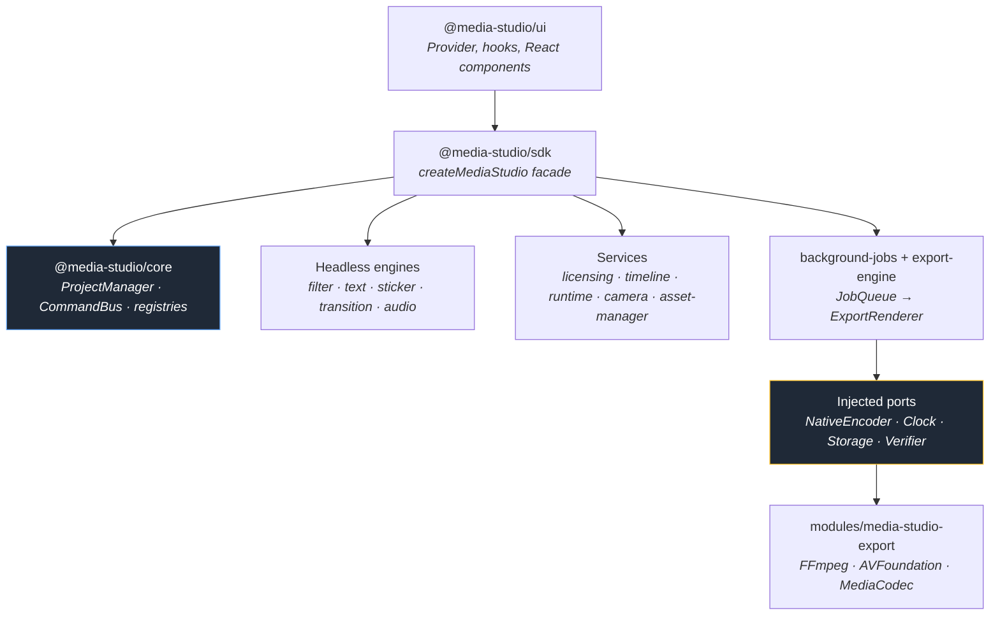

<div align="center">

# 🎬 Media Studio SDK

**The photo and video creation, editing and export SDK for React Native + Expo.**

Camera, photo editor, video editor, filters, animated text, stickers, transitions,
audio and background export — on a **100% headless** core that is fully
replaceable and drivable without any interface.

[](https://reactnative.dev)
[](https://expo.dev)
[](https://www.typescriptlang.org)
[](https://pnpm.io)
[](https://turbo.build)
[](./LICENSE)
[](./docs/10-ROADMAP.md)

[Documentation](./docs/README.md) · [Architecture](./docs/01-ARCHITECTURE.md) · [Roadmap](./docs/10-ROADMAP.md) · [Examples](#-examples) · **[Documentation 🇫🇷](./README.fr.md)**

</div>

---

## Why this SDK

Most media editing libraries impose their UI, their native pipeline and their data
model. Media Studio does the opposite:

| Principle | What it changes in practice |
|---|---|
| 🧠 **Headless-first** | All the logic (project, commands, engines, export) runs in Node, with no device and no UI. Testable in milliseconds. |
| 🔌 **Injected ports** | No hard native dependency: `NativeEncoder`, `Clock`, `LicenseValidator`, `StorageAdapter`, `PluginVerifier`, `FontManager`… are supplied by the integrator. |
| 🎛️ **Replaceable UI** | The React components shipped here are a convenience, not a constraint. Plug your own into the same controllers. |
| ↩️ **Everything goes through the CommandBus** | Every mutation is a command → undo/redo for free, history, serialisation. |
| 🧩 **Extensible by registry** | Filters, stickers, transitions, object types: added by plugin, checked by signature. |
| 🔑 **Licensing built in** | Capabilities (resolution, watermark, formats) follow from the plan. Graceful degradation rather than a crash. |

---

## ✨ Features

<table>
<tr>
<td width="50%" valign="top">

**📸 Capture & photo**
- Headless camera session (optical state, ratios, capture → project)
- Photo editor: cropping, layers, GPU LUT
- Skia preview composed in real time

**🎞️ Video & timeline**
- Headless video editing controller
- Time ↔ pixel timeline, snapping engine
- `play / pause / seek / loop` transport on a shared clock

</td>
<td width="50%" valign="top">

**🎨 Effects**
- Filters (catalogue + parameter resolution)
- Animated text (presets, animations, Font Manager)
- Stickers (categories, formats, animations)
- Transitions with an overlap constraint

**🚀 Output**
- Audio mixing (mix plan, gain with fades)
- Non-blocking background export (`JobQueue`)
- Automatic degradation according to the licence

</td>
</tr>
</table>

---

## 🚀 Quick start

```bash
git clone https://github.com/pasquelin/media-studio.git
cd media-studio
pnpm install
pnpm build
```

> **Note** — the packages are not published on npm yet. The SDK is consumed today
> from the monorepo (`workspace:*`) or through the example app.

### Headless — no device, no UI

```ts
import {
  createMediaStudio,
  createLicense,
  createExportRenderer,
  DEFAULT_EXPORT_CONFIG,
} from "@media-studio/sdk";

const license = createLicense("pro");

const studio = createMediaStudio({
  license,
  exportRenderer: createExportRenderer({ primary: nativeEncoder, license }),
});

// Every mutation goes through the CommandBus → undo/redo for free
studio.core.execute("video.create", {
  id: "v1",
  object: { source: "clip.mp4", startTime: 0, endTime: 5000, trim: { start: 0, end: 5000 } },
});
studio.core.execute("text.create", { id: "t1", object: { content: "Hello 👋" } });
studio.core.undo();

// Non-blocking export: the app stays usable
const job = studio.exportProject({ ...DEFAULT_EXPORT_CONFIG, resolution: "4k" });
```

### React Native — provider + editor

```tsx
import { MediaStudioProvider, MediaStudio, useMediaStudio } from "@media-studio/ui";

export default function App() {
  return (
    <MediaStudioProvider license={license} exportRenderer={renderer}>
      <Home />
      <MediaStudio preview={<SkiaPreview />} />
    </MediaStudioProvider>
  );
}

function Home() {
  const { open, jobs } = useMediaStudio();
  return <Button title="Edit" onPress={open} />;
}
```

### See it run

```bash
# Runnable headless demo (Node, no device required)
pnpm -F @media-studio/example-headless start

# Full Expo app (capture → crop → edit → export)
pnpm -F @media-studio/example-studio-app start
```

---

## 🧱 Architecture



**Golden rule**: the logic never depends on the native side. Native code is plugged
in at runtime through a port. That is what makes the whole chain testable in Node
and the rendering replaceable.

---

## 📦 Packages

| Package | Role |
|---|---|
| [`core`](./packages/core) | Pure core: `ProjectManager`, `CommandBus`, registries, built-in commands |
| [`sdk`](./packages/sdk) | Single entry point + the `createMediaStudio` facade |
| [`ui`](./packages/ui) | React layer: `MediaStudioProvider`, hooks, `<MediaStudio>`, theming |
| [`camera`](./packages/camera) | Headless capture session (optical state, capture → project) |
| [`photo-editor`](./packages/photo-editor) · [`video-editor`](./packages/video-editor) | Headless editing controllers |
| [`filter-engine`](./packages/filter-engine) | Filter catalogue + parameter resolution |
| [`text-engine`](./packages/text-engine) | Presets, animations, Font Manager |
| [`sticker-engine`](./packages/sticker-engine) | Categories, formats, animations, registry |
| [`transition-engine`](./packages/transition-engine) | Transition catalogue + overlap constraint |
| [`audio-engine`](./packages/audio-engine) | Mix plan, gain with fades, role validation |
| [`music-library`](./packages/music-library) | Music library (catalogue + replaceable `MusicSource`) |
| [`runtime`](./packages/runtime) | `play / pause / seek / loop` transport machine |
| [`timeline`](./packages/timeline) | Time ↔ pixel conversion + snapping engine |
| [`renderer/preview`](./packages/renderer/preview) | Skia `PreviewRenderer` (layer composition) |
| [`background-jobs`](./packages/background-jobs) | Non-blocking export queue (`JobQueue`) |
| [`export-engine`](./packages/export-engine) | Licence degradation + `ExportRenderer` (`NativeEncoder` port) |
| [`licensing`](./packages/licensing) | Plans → capabilities (`createLicense`) |
| [`security`](./packages/security) | Plugin signature verification |
| [`asset-manager`](./packages/asset-manager) | `ResourcePack` registry + licence gating |
| [`cli`](./packages/cli) | `media-studio` CLI (`init`, `new-project`, `create-plugin`, `doctor`) |

Alongside them: [`modules/media-studio-export`](./modules) (native Expo module),
[`examples/`](./examples) (headless demo + Expo app),
[`website/`](./website) (public Docusaurus documentation).

---

## 🧑‍💻 Examples

| Example | What it shows |
|---|---|
| [`examples/headless-demo`](./examples/headless-demo) | The whole chain in Node: project, commands, undo/redo, licence & gating, catalogue, runtime, background export |
| [`examples/studio-app`](./examples/studio-app) | Full Expo app: camera capture, cropping, editor (GPU LUT filters, stickers, text), timeline, export |

---

## 🛠️ Development

```bash
pnpm build        # build every package (Turborepo)
pnpm typecheck    # strict typecheck
pnpm test         # tests (Vitest)
pnpm lint         # lint
pnpm format       # Prettier
pnpm changeset    # prepare a release
```

**Stack**: pnpm workspaces · Turborepo · strict TypeScript · Vitest · Changesets · tsup

### Git workflow

| Branch | Role |
|---|---|
| `main` | Production only |
| `develop` | Development integration — every branch starts here |
| `feat/*` `fix/*` `chore/*` | Working branches → PR into `develop` |

---

## 📚 Documentation

The architecture blueprint is the project's **source of truth**: 28 documents
numbered from *why* towards *how*.

👉 **[docs/README.md](./docs/README.md)** — entry point

| | |
|---|---|
| [Vision](./docs/00-VISION.md) | Mission, positioning, principles |
| [Architecture](./docs/01-ARCHITECTURE.md) | Layers, dependency rules, flows |
| [Project Schema](./docs/02-PROJECT-SCHEMA.md) | Data model, migrations |
| [Plugin API](./docs/06-PLUGIN-API.md) | Extension points |
| [Export Engine](./docs/09-EXPORT-ENGINE.md) | Pipeline, formats, codecs |
| [Configuration](./docs/12-CONFIGURATION.md) | Full configuration contract |
| [Roadmap](./docs/10-ROADMAP.md) | Build milestones |

The blueprint itself is written in French.

---

## 📄 Licence

[MIT](./LICENSE) © pasquelin
